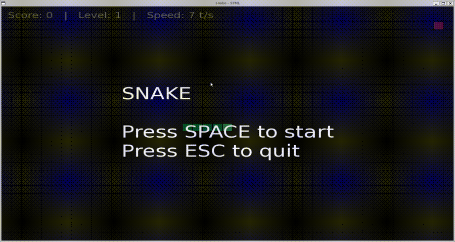

# 🐍 Snake SFML

A modern implementation of the classic **Snake game**, developed in **C++ (C++17)** using **SFML**, with a strong focus on **object-oriented design**, **clean architecture**, and **maintainability**.

This project was built step by step with clear Git commits and UML documentation, making it suitable as a **portfolio project** for software engineering and game development roles.

---

## 🎮 Gameplay Preview



---

## ✨ Features

* Classic Snake gameplay with smooth movement
* Grid-based rendering using SFML
* Wall and self-collision detection
* Food spawning on free cells only
* Snake growth and score system
* Increasing difficulty over time
* Start, Pause, Playing and Game Over states
* Keyboard input handling
* Clean separation between game logic and rendering

---

## 🕹️ Controls

| Key         | Action             |
| ----------- | ------------------ |
| ⬆️ ⬇️ ⬅️ ➡️ | Move the snake     |
| **SPACE**   | Start / Play again |
| **P**       | Pause / Resume     |
| **R**       | Restart game       |
| **ESC**     | Quit the game      |

---

## 🧱 Project Structure

```
snake-sfml/
├── assets/
│   ├── fonts/
│   └── screenshots/
├── docs/
│   └── diagrams/
├── include/
│   ├── core/
│   └── graphics/
├── src/
│   ├── core/
│   └── graphics/
├── CMakeLists.txt
└── README.md
```

---

## 🧠 Architecture Overview

The project follows a clear separation of responsibilities:

* **Game**
  Manages the main loop, game states (Start, Playing, Paused, Game Over), input handling, and overall game logic.

* **Snake**
  Handles movement, direction, growth, and self-collision detection.

* **Food**
  Manages food position and respawning logic.

* **Renderer**
  Responsible for all graphical rendering (grid, snake, food, UI overlays).

This architecture makes the project easy to understand, extend, and maintain.

---

## 📐 UML Diagrams

To document the design and runtime behavior, the project includes UML-style diagrams created with **Mermaid**:

* **Class Diagram**
* **Game Loop Sequence Diagram**
* **State Machine Diagram** (Start / Playing / Paused / Game Over)

📁 Available in:

```
docs/diagrams/
```

---

## ⚙️ Build & Run

### Requirements

* Linux or WSL (Ubuntu)
* C++17 compatible compiler
* SFML 2.5+
* CMake 3.16+

Install dependencies:

```bash
sudo apt update
sudo apt install -y g++ cmake libsfml-dev
```

### Build

```bash
cmake -S . -B build
cmake --build build
```

### Run

```bash
./build/snake
```

---

## 🚀 Future Improvements

The current architecture allows easy extension, such as:

* Sound effects and background music
* High score persistence
* Difficulty levels and speed settings
* Improved UI and animations
* AI-controlled snake mode

---

## 👤 Author

**Bilal Allouch**


GitHub: [https://github.com/bilal-allouch](https://github.com/bilal-allouch)

---
